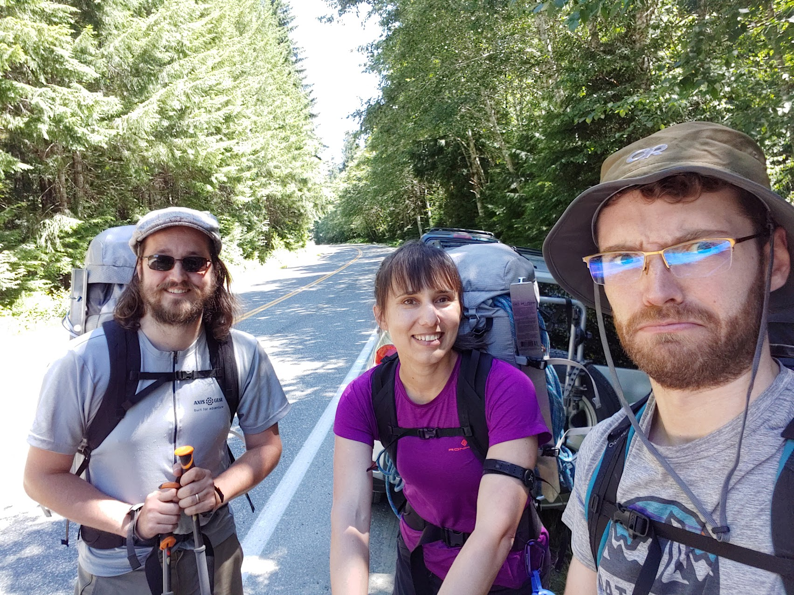

# Elkhorn Mountain
[photo album](https://photos.app.goo.gl/Aci2EfPtyfxPxd9e9)

## Getting There
After an early wake up, we took a 5hr drive from Victoria, and started hiking in right away.

## Day 1
With a longer than remembered from previous trips on the ERT, we found the turn off to go up the elkhorn alley.

Crossing logs, we traversed the river. Getting momentarily displaced on the far side, we located the trail again, and moved upwards.

We met another group on their way down <trip report here>, who gave good beta, so we could ditch gear in the woods.
We left all our crampons, ice axes and snow pickets in a small stash.

There was a long gentle woods walk, followed by lots and lots of up, with a few fixed lines. We reached the ridge line late in the afternoon,
poking our heads out in a granite boulder field with patchy snow.

Debating how far up to push, we settled on a camp near a tarn.

## Day 2
Early rise, boil water the moment the alarms went off, and off we went. The ridge line was better travelling, some snow to cross, nie and cool in the summer day.

Once we reached the base of the peak's proper base, we got our harnesses on, and set off scrambling, route finding was a little nervous making, but we travelled up and to the left, pitching out our first crack.

After the first pitch we traversed a scree slope, and a rather exposed ledge, as we trended right around the gendarme, rappelling off the back to a saddle between the gendarme and the peak proper.

More route finding, another pitch, and we were on the boulder pile that makes up the rubbley peak.

## Descent
Oh god was it a long way, lots of rappels, and hiking in full shank boots. We were zombies near the end, and my feet were sore. a month later my toe nails fell off from all that time in full shank boots.

Drove home with a sleep in the car for an hour or two on the side of the highway.
