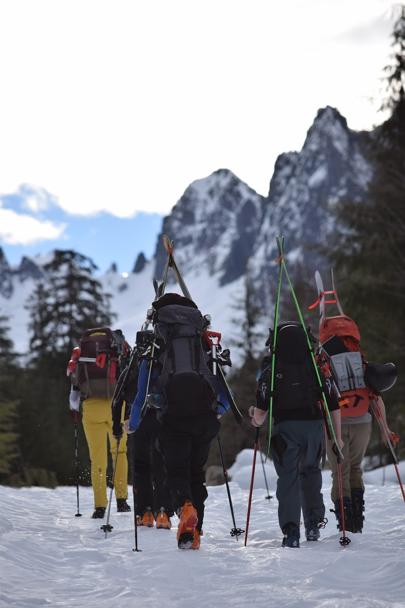
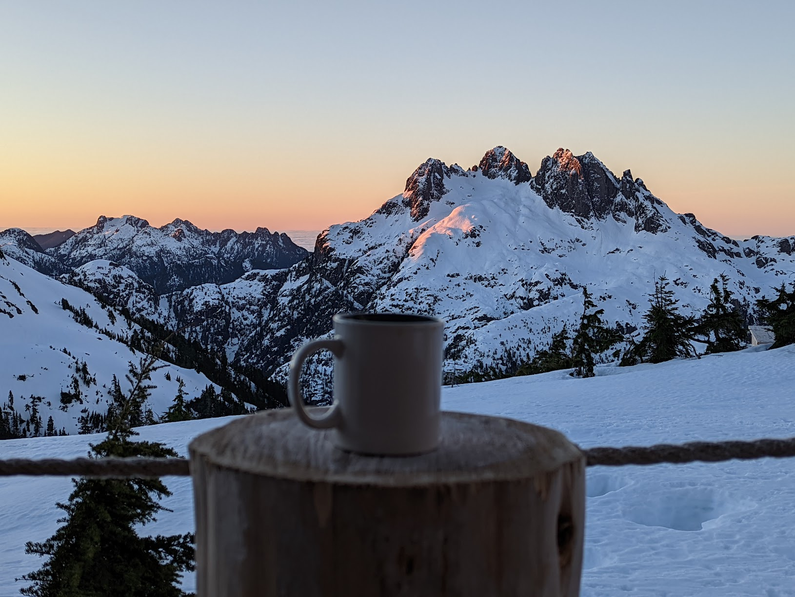

# 5040 Peak (Hišimy̓awiƛ Hut)

[photos here](https://photos.app.goo.gl/TBafftjf7kaebusH9)

## Trip Plan

## Day 1 (approach)
- left Victoria at 5am
- started hiking from car at 9am (exactly on time)
- at trailhead at 12:30
- snowshoers arrived at 3:45pm
- skiiers at hut at 5pm (sunset)
- dinner at 6:30pm (mac'n cheese and lentil stew)

## Day 2 (peak day)
- 3 snowshoers (Torben/Bridget/Tim) went out for a day trip.
- 4 skiers did laps in the afternoon just above the hut.
- 1 person enjoyed a day at the hut.
- 6:30pm dinner (chili)

### Detailed Trip Report
> We left a 8:30 AM. Snow was hard having frozen overnight, and we had little difficulty
 making progress, with the exception of Tim who had some difficulty with snowshoes that
 had less teeth to grip on the hard surfaces. 
> 
> While crossing any areas that had some exposure or avalanche risk, we exercised caution
 and maintained a lot of separation between individuals. We had one of the snowshoers
 with better snowshoes go first.
>
> After reaching the saddle between 5040 and the sub-peaks to the south, we took some
 time to assess the descent down to the ridge which would take us towards Nahmint peak.
 The aspect was not as sun exposed and pretty windswept. We were limited in our ability
 to see the entire route and had concerns about running in to a cliff, so we took it
 slowly and in several stages. Each time stopping to asses and eventually send a
 snowshoer with better traction down to look at what the next section would entail.
 Eventually we made it down and went to a local high point that offered a view of the
 ridge line that we were considering traversing. However we decided not to continue
 because the day was very warm and sunny, so we had concerns about avalanche risk and
 changing conditions from the heat.
> 
> For the return, we considered taking an alternate route from the one we descended
 because the map showed some approaches that would be less steep. But they would also put
 us closer to cliff exposure. We ended up deciding to return the same way we descended
 and it proved to be quite easy. The snow was still hard and we had good traction.
> 
> After climbing back up to the saddle below 5040 (above the hut), we went to those local
 sub peaks to the south, radio'd the hut and snapped some more pictures. Then we
 briefly considered ascending the 5040 peak, but decided not to because of concerns of
 changing/worsening conditions from the sun. So we started to head back to the hut...
> 
> Returning to the hut from the saddle meant crossing the most sun exposed aspects. The 
 snow was much softer than the other aspects we had been on and had started softening
 from the sun. We continued our practice of having the snowshoers with better traction
 lead the way, and maintaining distance between party members. This turned out to be a
 very good idea, as the first snowshoer who crossed the most exposed and steep section
 slipped during their traverse and began sliding. Fortunately they were able to
 self-arrest and slowly make their way to a point of safety. The remaining two
 snowshoers then moved to a lower part of the aspect so that they could approach with a
 climb instead of traversing laterally, using shovels as self arrest / traction tools.
 This offered better traction and we were able to quickly reach the stranded snowshoer.
 From that point we improved our strategy of moving vertically as much as possible.
>
> ~ Torben

### Take Aways
> Conditions are dynamic and can change significantly throughout the day!
Maintaining separation meant that only one person had a close call and others were safe and able to help while learning from the experience of the first person.
We were more concerned about the avalanche risk of the solar heating, but the slushy/soft snow created a real slipping hazard which we were less expecting.
Approaching the slope with as much of a vertical track as possible, ascending rather than descending, felt like a safer way to deal with the slippery conditions. Lateral traverses were the most hazardous.
Don't let your guard down! We had little trouble during most of our trip and ran into trouble right by the hut, close to others and in an area where we had previously been safe and felt comfortable. (Note: we did not let our guard down and did apply best practices, this was just a reminder of that being a good idea).
>
> The snow was so icy that the skiers waited till the afternoon to do some laps behind the hut.

## Day 3 (descent)
7am alarm, everyone moving by 7:30. We ate breakfast, cleaned the hut and were out the door by 9:30? leaving the hut in good shape for the next group.
Skiers scraped their way down on ice to the tree line (still fun), and snowshoers caught up as we were transitioning to bootpack down to the logging road.

Skiers transitioned between skiing and walking for the logging road, and made were on the rive by 1:20pm. Snowshoers at 2pm.

## Future Trip Edits
- ear plugs (in case of snoring)
- group luxuries enumerated
  - we packed 5.5L of red wine (a little much)
  - one DSL camera came up (good idea)
- wet whipes for car return (for face)