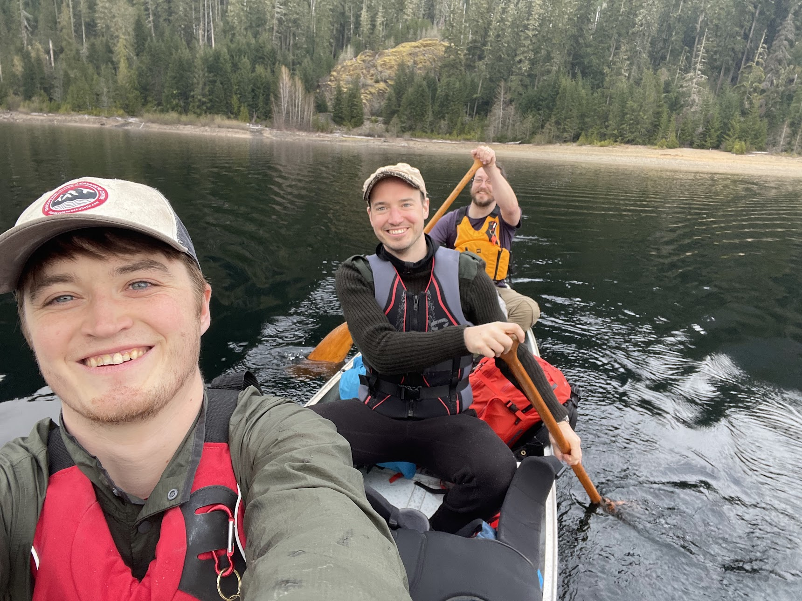
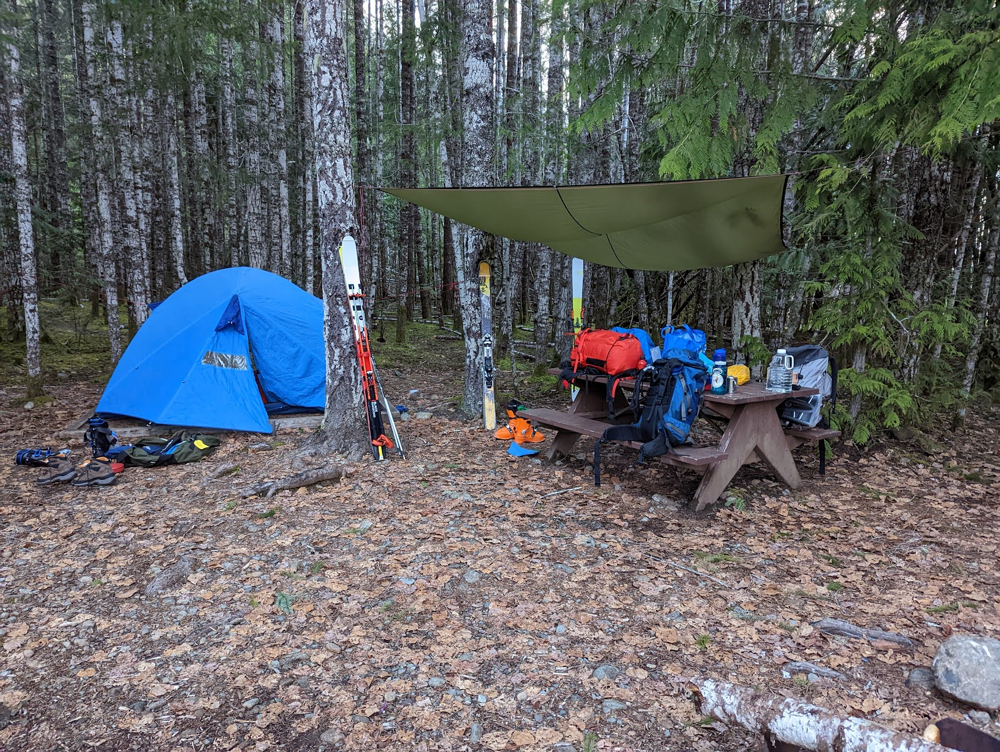
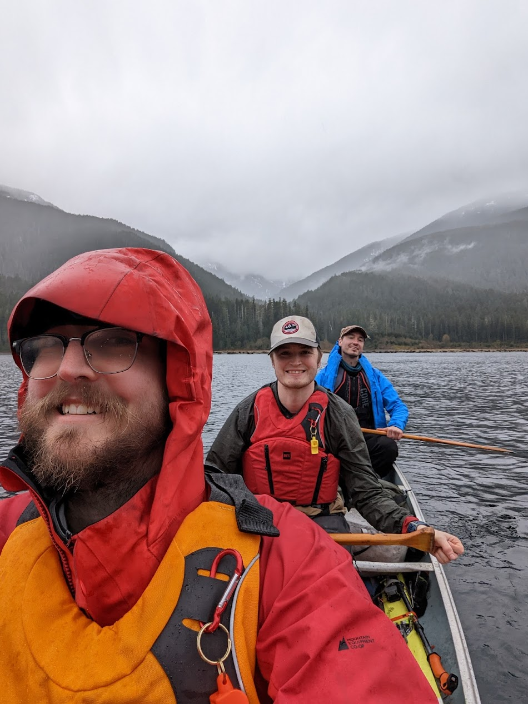
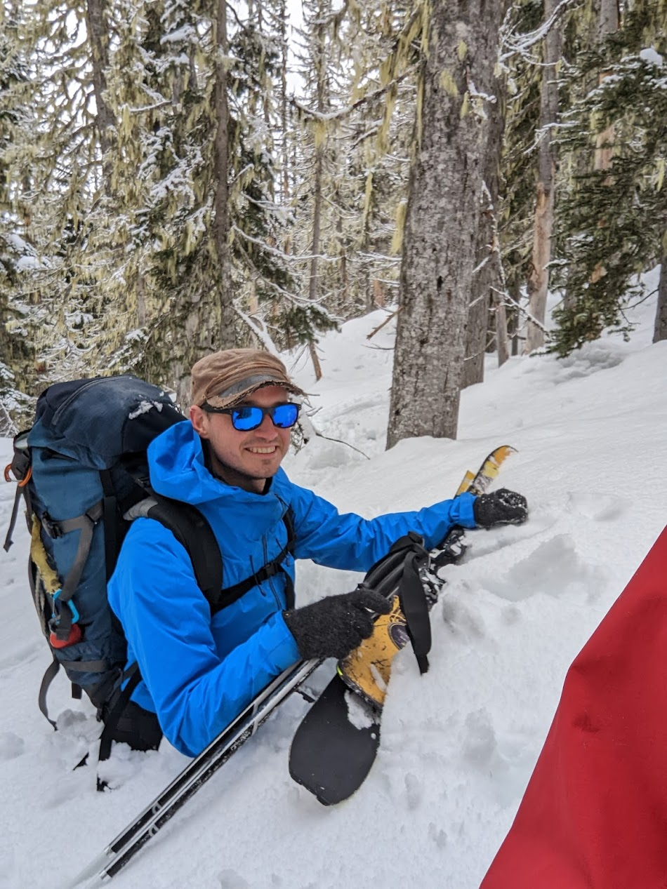

# Canoe/Hike/Ski Marble Meadows

[photos here](https://photos.app.goo.gl/ceXB8J3Yd3uUYSUe9)

## Day 1 (to base camp)
- left Victoria at 1pm
- canoeing across Buttle lake by 6pm
- setup base camp and have dinner

## Day 2 (base camp to hut)
- alarm for 5am
- set out hiking at 6:30am
- at 1000m elevation we switched to skis
- skied to hut, and then dug it out

## Day 3 (descent)
- 6am alarm, everyone moving by 6:30
- We ate breakfast and cleaned the hut 
- out the door by 8:15, leaving the hut in good shape for the next group

## Future Trip Edits
- remember dinner and spoon from basecamp
- tea bags are a light luxury
- slightly more arch support in ski boots (to avoid blisters)
- more bungies for backpack (colourful?)

